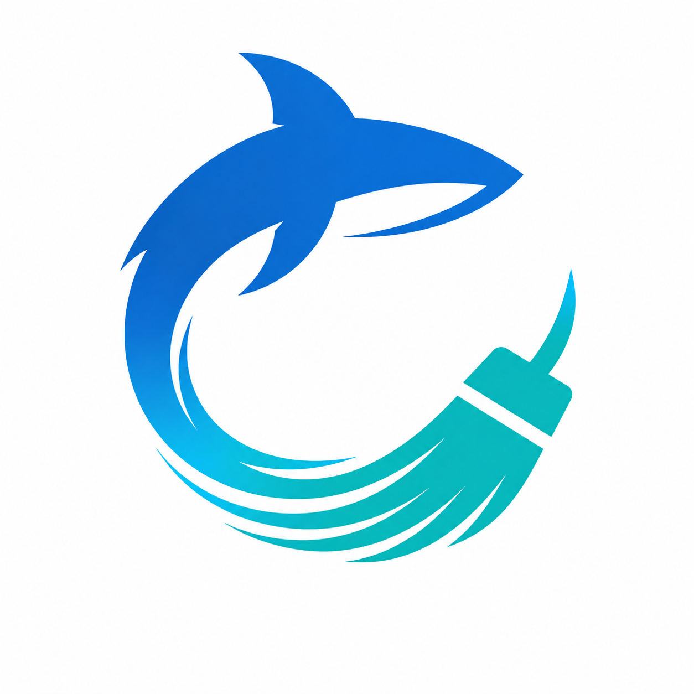

<div align="center">
  
  <h1>CoreCare</h1>
  <p><strong>Pochopte svůj počítač. Čistěte bezpečně. Mějte cestu zpět.</strong></p>
  <p>
    <a href="https://github.com/jkaczmarczyk96-code/core-care-releases/releases"></a>
    
    
  </p>
  <p>Čeština · <a href="README.md">English version</a></p>
</div>

CoreCare je bezpečnostně zaměřená aplikace pro zdraví počítače. Je určená
uživatelům, kteří chtějí získat více volného místa a udržovat systém v dobrém
stavu, ale nechtějí svěřit důležitá rozhodnutí slepému čištění jedním kliknutím.
Spojuje chytré čištění, diagnostiku disků, správu aplikací po spuštění,
aktualizace, ochranu soukromí a sledování výkonu do jedné přehledné aplikace.

CoreCare nejprve skenuje a vysvětluje. Bez kontroly a potvrzení uživatele nic
nemaže, neopravuje, nevypíná ani neaktualizuje.

> **Beta zdarma:** CoreCare je stále ve vývoji. Důležitá data mějte zálohovaná a
> před potvrzením vždy zkontrolujte navržené systémové změny.

## Stažení CoreCare

Všechny oficiální instalátory a aktualizační balíčky najdete na stránce
**[Releases](https://github.com/jkaczmarczyk96-code/core-care-releases/releases)**.

| Platforma | Doporučený soubor | Aktuální veřejná beta | Poznámka |
| --- | --- | --- | --- |
| Windows 10/11 x64 | `CoreCare-win-Setup.exe` | `0.1.0-beta.89` | Instalátor Velopack s automatickými aktualizacemi. Současná beta není podepsaná, proto může Windows zobrazit varování vydavatele. |
| Linux x64 | `CoreCare.AppImage` | `0.1.0-beta.93-linux` | Samostatný AppImage s vlastním linuxovým aktualizačním kanálem. |

### Spuštění na Linuxu

Po stažení nastavte AppImage jako spustitelný a otevřete jej:

```bash
chmod +x CoreCare.AppImage
./CoreCare.AppImage
```

Soubory s příponou `.nupkg`, `RELEASES` nebo `releases.*.json` jsou metadata pro
automatické aktualizace. Běžný uživatel je nemusí stahovat ani ručně otevírat.

## Funkce

### Smart Cleaner

- Skenuje libovolnou uživatelem vybranou kombinaci pevných disků.
- Nachází velké soubory, stará dočasná data, archivy, obrazy disků, cache a
  složky obsahující velké množství malých souborů.
- Posuzuje každý výsledek podle kontextu, umístění, vlastníka, stáří, velikosti a
  rizika.
- Chrání systémová umístění, nainstalované aplikace, herní knihovny, uložené
  pozice, konfigurace a osobní soubory.
- Automaticky vybírá pouze konzervativní kandidáty s nízkým rizikem.
- Před čištěním vysvětlí důvod nálezu a navrhovanou akci.
- Kde je to možné, používá Koš ve Windows a systémový Koš na Linuxu.
- Nabízí řazení, filtrování, samostatný výběr, kontrolu před odstraněním a průběh
  operace.

### Zdraví disků a opravy

- Zobrazuje využité a volné místo, souborový systém a tlak na kapacitu.
- Nabízí vedené kontroly disků s průběhem a výsledkem přímo v CoreCare.
- Rozpoznává běžné varovné signály úložiště a souborového systému.
- Otevírá vhodné opravné a úložné nástroje podle platformy.
- Na Linuxu sleduje zařízení, dostupnou teplotu, podporu TRIM, SMART stav,
  Btrfs kontroly a vývoj zaplnění disku.
- Na Linuxu umí ověřit soubory spravované balíčkovacím systémem a opravit
  závislosti pomocí důvěryhodných nástrojů distribuce.
- Privilegované a potenciálně rušivé akce vždy vyžadují výslovné spuštění.

### Po spuštění

- Nachází aplikace nastavené ke spuštění po přihlášení uživatele.
- Měří aktuální využití procesoru a paměti u běžících aplikací na pozadí.
- Zvýrazňuje aplikace překračující konzervativní hranice spotřeby prostředků.
- U podporovaných položek nabízí vratné zapnutí a vypnutí.
- Nikdy žádnou aplikaci nevypne automaticky.

### Aktualizace a obnovení

**Windows**

- Vyhledává dostupné aktualizace ovladačů přes Windows Update.
- Před instalací vybraných ovladačů vytváří jejich místní zálohu.
- Zobrazuje průběh instalace, výsledek, nutnost restartu a historii aktualizací.

**Linux**

- Vyhledává systémové balíčky, jádro, firmware a ovladače přes APT, DNF, Pacman
  nebo Zypper.
- Před vybranými aktualizacemi vytváří body obnovy balíčků.
- Aktualizaci spustí pouze tehdy, když má každý vybraný balíček ověřený zdroj pro
  případný návrat.
- Nabízí podporované obnovení předchozí verze a historii balíčkovacího systému.

### Soukromí

- Smart Cookie Cleanup je volitelný a ve výchozím stavu vypnutý.
- Rozpoznává podporované profily prohlížečů založených na Chromiu a Firefoxu.
- Seskupuje cookies podle domén a umožňuje výběr jednotlivých webů.
- Odmítne upravit profil, pokud je daný prohlížeč spuštěný.
- Před odstraněním vytváří místní zálohu databáze a umožňuje její obnovení.
- Nechá nedotčené nevybrané cookies i historii prohlížení.

### Výkon a přehled zdraví

- Zobrazuje živé údaje o procesoru, paměti, procesech, úložišti a aplikacích.
- Upozorňuje na významnou spotřebu prostředků místo označení každého procesu za
  problém.
- Spojuje stav čištění, úložiště, aplikací po spuštění, aktualizací, soukromí a
  výkonu do jednoho přehledu.
- Uchovává místní historii čištění a údržby.
- Obsahuje české a anglické rozhraní, changelog v aplikaci a upozornění na nové
  verze.

## Jak CoreCare chrání počítač

1. **Skenuje lokálně** bez změn v počítači.
2. **Vysvětlí nález** a jeho riziko srozumitelným jazykem.
3. **Vyžádá kontrolu** před čištěním, opravou, aktualizací nebo změnou spuštění.
4. **Blokuje chráněná umístění** operačního systému a aplikací.
5. **Upřednostňuje cestu zpět** přes Koš, zálohy a body obnovy balíčků.

CoreCare záměrně nečistí registry, nemaže bez rozlišení cookies či historii a
neprovádí hromadné systémové změny jedním kliknutím.

## Soukromí

CoreCare v současnosti nevyžaduje účet, předplatné, reklamní identifikátor ani
analytickou službu. Seznamy souborů, výsledky skenů a historie aktivit zůstávají
v počítači. Připojení k internetu se používá pro kontrolu nové verze aplikace a
pro uživatelem vyžádané aktualizace operačního systému.

Podrobnosti jsou uvedené v [PRIVACY.md](PRIVACY.md).

## Automatické aktualizace aplikace

CoreCare používá [Velopack](https://velopack.io/) a tento veřejný repozitář jako
oficiální aktualizační kanál. Nainstalovaná aplikace může zjistit novou verzi,
zobrazit poznámky k vydání, stáhnout správný balíček a restartovat se do
aktualizace. Windows a Linux mají oddělené kanály, takže nelze zaměnit balíčky
mezi platformami.

## Stav platforem

| Oblast | Windows | Linux |
| --- | :---: | :---: |
| Vedené čištění a ochrana systémových cest | Dostupné | Dostupné |
| Kapacita disků a doporučení ke zdraví | Dostupné | Dostupné |
| Aplikace po spuštění a využití prostředků | Dostupné | Dostupné |
| Aktualizace ovladačů nebo systémových balíčků | Dostupné | Dostupné |
| Místní obnova před aktualizací | Záloha ovladače | Bod obnovy balíčků |
| Smart Cookie Cleanup se zálohou | Dostupné | Dostupné |
| České a anglické rozhraní | Dostupné | Dostupné |

## Kompatibilita linuxových distribucí

Současný AppImage je určený pro **64bitový Linux na procesorech Intel/AMD
(`linux-x64`)** s glibc a grafickým prostředím X11 nebo XWayland. Běhové prostředí
.NET je součástí aplikace.

| Rodina distribucí | Stav | Integrace CoreCare |
| --- | --- | --- |
| Ubuntu 22.04/24.04, Debian 12/13, Linux Mint, Pop!_OS, Zorin OS | Doporučené | APT a DPKG |
| Fedora 42-44, RHEL 8-10, CentOS Stream 9/10 | Doporučené | DNF a RPM |
| openSUSE Leap 16 | Doporučené | Zypper a RPM |
| Arch Linux, Manjaro, EndeavourOS | Beta podpora | Pacman |
| Ostatní desktopové distribuce s glibc | Vyžadují otestování | Podle dostupných systémových nástrojů |

Immutable systémy jako Fedora Silverblue, Kinoite a SteamOS mohou omezit opravy
balíčků a systémové změny. NixOS může vyžadovat `appimage-run` nebo kompatibilní
FHS prostředí. Alpine/musl, zařízení ARM, Raspberry Pi a systémy bez grafického
prostředí současný build nepodporuje.

Desktop vyžaduje běžné knihovny X11. Administrátorské opravy používají PolicyKit
s příkazem `pkexec`; hlubší diagnostika disků může využívat `findmnt`,
`smartmontools` a `btrfs-progs`. Podrobnosti uvádějí
[požadavky Avalonie pro Linux](https://docs.avaloniaui.net/docs/platform-specific-guides/linux)
a [matice podpory .NET 9](https://github.com/dotnet/core/blob/main/release-notes/9.0/supported-os.md).

macOS je plánovaný jako samostatná nativní implementace; mobilní platformy
nejsou součástí současné desktopové bety.

## Podpora a bezpečnost

- Běžné chyby a návrhy funkcí hlaste přes
  [GitHub Issues](https://github.com/jkaczmarczyk96-code/core-care-releases/issues).
- U bezpečnostních problémů postupujte podle [SECURITY.md](SECURITY.md).
- Uveďte verzi CoreCare, operační systém, dotčenou část aplikace a postup, kterým
  lze problém zopakovat.
- Do veřejného issue nikdy nevkládejte přihlašovací údaje, soukromé dokumenty,
  databáze cookies ani osobní výsledky skenu.

## O tomto repozitáři

Toto je oficiální veřejný repozitář binárních souborů a aktualizací CoreCare.
Repozitář se zdrojovým kódem aplikace je soukromý. GitHub může u tagů automaticky
nabízet archivy „Source code“; ty obsahují pouze veřejné soubory tohoto release
repozitáře, nikoli soukromý zdrojový kód aplikace CoreCare.

Přítomnost binárních souborů v tomto repozitáři neposkytuje licenci ke zdrojovému
kódu.

Copyright © přispěvatelé CoreCare. Všechna práva vyhrazena.
